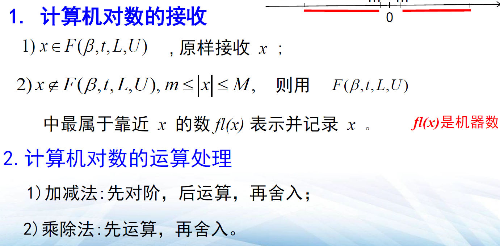
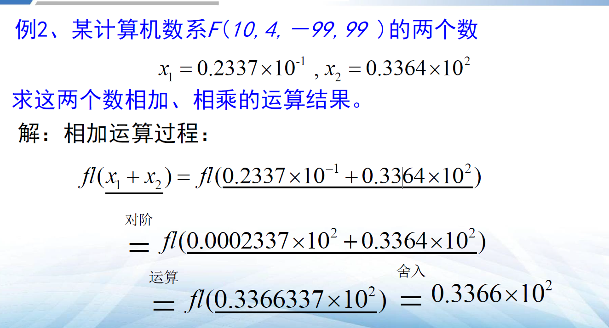
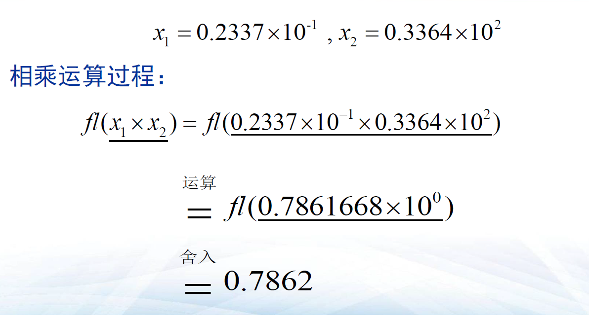
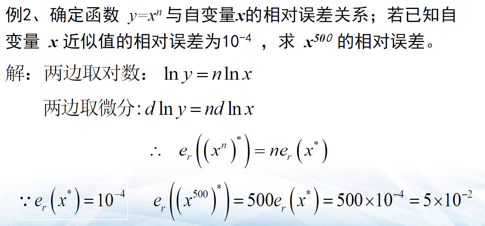
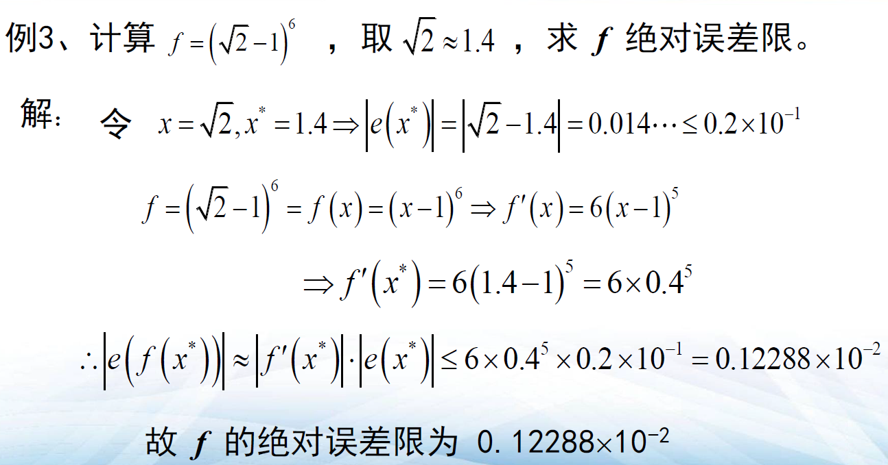

# 第一章 绪论
 - [第一章 绪论](#第一章-绪论)

## 1.1 机器数系
* **机器数系**：$F（\beta,t,L,U)=\{\pm\beta^c\times0.a_1a_2...a_t|a_t\in\{0,1,...,\beta-1\},L\le c\le U\}$  
$t$:字长  
$\beta$：进制，一般为2，8，10，16  
$c$:阶码，整数

* 规格化浮点数：当$a_1\neq0$时

* $F$有$2\times\beta^t\times(U-L+1)$个

* 计算机对数的接收：  

   
  
  

## 1.2 误差
### 1.2.1误差概念与性质
* $x$为准确值,$x^*$为近似值,$e$为绝对误差，$e_r$为相对误差
* 绝对误差是近似值减精确值，相对误差是绝对误差除以**精确值**
* 误差限：误差取绝对值
* 与微分的关系：①绝对误差为$dx$ ②相对误差为$d\ln x$  

   

### 1.2.2四则运算误差
① $e(x^*\pm y^*)=e(x^*)\pm e(y^*)$  
② $e(x^*\cdot y^*)\thickapprox y^*e(x^*)+x^*e(y^*)$  
③ $e(\frac{x^*}{y^*})=\frac{y^*e(x^*)-x^*e(y^*)}{(y^*)^2}$  
ps:本质是求导

### 1.2.3函数误差
几个麻烦公式省略  

特别地，对于一元函数$y=f(x)$  
$|e(f(x^*))|\thickapprox|f'(x^*)|\cdot|e(x^*)|$  
含义为$x^*$的误差经$f$作用被放大（缩小）$|f'(x^*)|$倍，且$|f'(x^*)|$被称为绝对误差增长因子  

